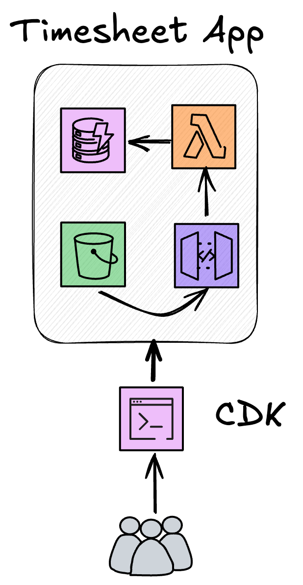

# AWS Community Day 2025 - Demo

This is a demo LocalStack Application for the AWS Community Day 2025.

You can use this repository to reference CI/CD Pipelines, Pre-Commit configurations and Testing examples for LocalStack.

This code is provided under the MIT License and you may use or reference it however you like, **BUT** it is provided as is, and no support or guarentees from me will be provided.

## Deploying

### Prerequisites
- [Install the AWS CDK](https://docs.aws.amazon.com/cdk/v2/guide/getting-started.html)
- [Install the CDKLocal Wrapper](https://github.com/localstack/aws-cdk-local)
- A running instance of [LocalStack](https://docs.localstack.cloud/aws/getting-started/installation/)

### Deployment
Navigate to the root of the dirctory, and run `cdklocal bootstrap` and `cdklocal deploy`.

The stack will output local URLs you can use to validate the API and access the website through the emulated S3 Bucket.

## Timesheets

Timesheet is a serverless AWS application that can be used to track your time (since we all love timesheets).

### Architecture

The architecture of the application is entirely serverless, making use of S3, Lambda, API Gateway and DynamoDB.

